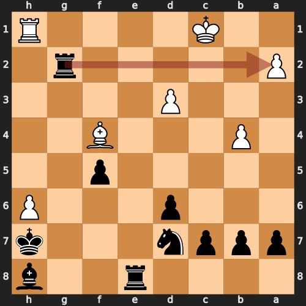
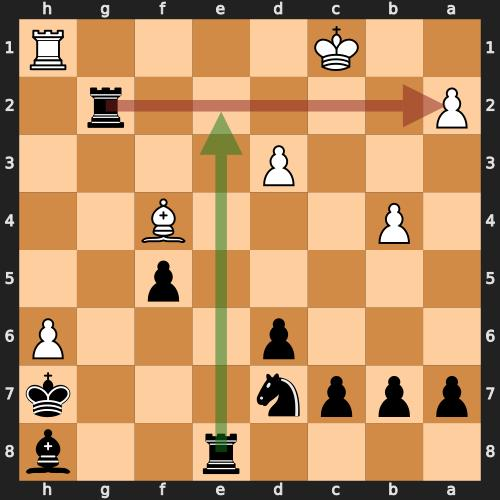

# chess_positions

## Chess Flash Card POC

A python script that reads in single and multi game PGNs, finds goofs aka bad moves via Stockfish and prepares flash cards that can be imported into [Anki](https://apps.ankiweb.net/)

Examples  
```python flash_cards.py --pgn_path 'pgn/chess_com_games_2023-05-16.pgn'```  
```python flash_cards.py --pgn_path 'pgn/lichess_bobhaffner_2023-05-16.pgn'```  
```python flash_cards.py --player_name bobhaffner --pgn_path 'pgn/chess_com_games_2023-05-16.pgn'```  
```python flash_cards.py --goof_threshold 200 --pgn_path 'pgn/chess_com_games_2023-05-16.pgn'```  


### Front

### Back



## ToDos
### * Classify cards ( eg missed capture, missed check, blundered piece, etc)
### * Investigate the use of older versions of Stockfish to get more "head slappers"


### Credits
[python-chess](https://github.com/niklasf/python-chess)