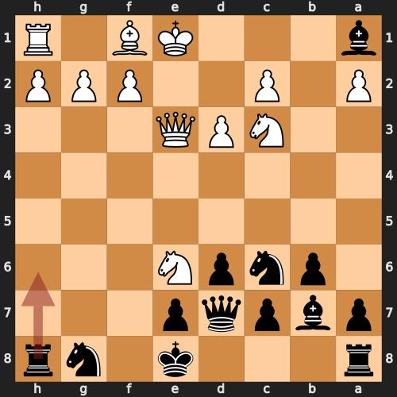
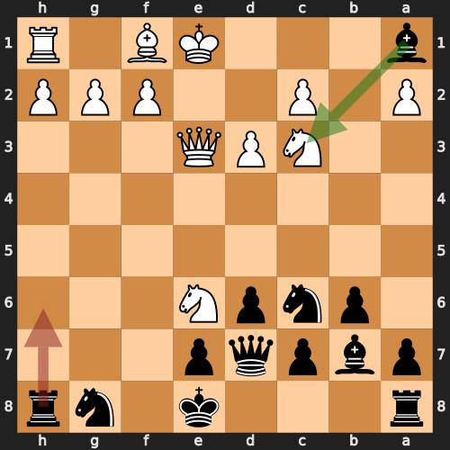

# chess_positions

## Chess Flash Card POC

## ToDos
### * Classify cards ( eg missed capture, missed check, etc)
### * Read PGNs.  This would open it up to Lichess games and leverage chess com and lichess UI to select and download games

